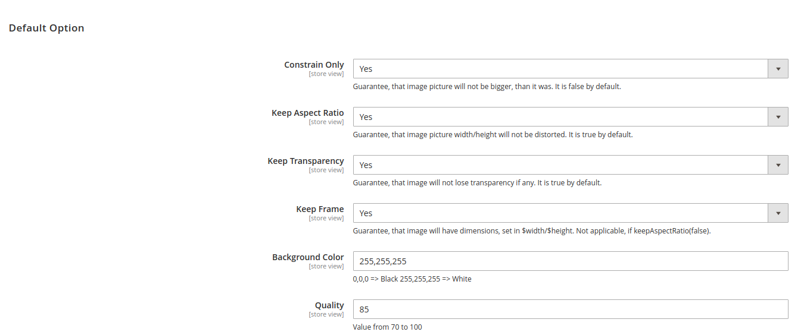
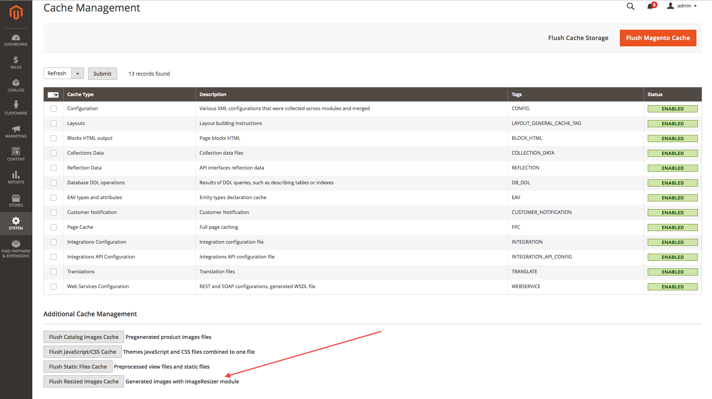

# Magento 2 Image Resize

Magento 2 Module to add simple image resizing capabilities in all blocks and .phtml templates

## Installation

```
$ composer require "web200/magento-mod-web200_image-resize":"*"
```

## Simple resize image usage

### ViewModel
Layout
```xml
<?xml version="1.0"?>
<page xmlns:xsi="http://www.w3.org/2001/XMLSchema-instance" xsi:noNamespaceSchemaLocation="urn:magento:framework:View/Layout/etc/page_configuration.xsd">
    <body>
        <referenceContainer name="header.container">
            <block name="authlinks" template="Magento_Theme::authlinks.phtml">
                <arguments>
                    <argument name="image_resize" xsi:type="object">Web200\ImageResize\ViewModel\ImageResize</argument>
                </arguments>
            </block>
        </referenceContainer>
    </body>
</page>
```

phtml
```php
<?php /** @var \Web200\ImageResize\ViewModel\ImageResize $imageResize */ ?>
<?php $imageResize = $block->getImageResize() ?>
<?php 
/**
* $originalImage can be a full url image : https://mywebsite.com/pub/media/catalog/product/a/b/001.jpg
* or relative media path : catalog/product/a/b/001.jpg
*/
?>
<?php $imageResize->getResize()->resizeAndGetUrl($originalImage, $width, $height, $resizeSettings);
```

### Helper

phtml
```php
<?php /** @var \Web200\ImageResize\Helper\Resize $resizeHelper */ ?>
<?php $resizeHelper = $this->helper(\Web200\ImageResize\Helper\Resize::class) ?>
<?php 
/**
* $originalImage can be a full url image : https://mywebsite.com/pub/media/catalog/product/a/b/001.jpg
* or relative media path : catalog/product/a/b/001.jpg
*/
?>
<?php $resizeHelper->getResize()->resizeAndGetUrl($originalImage, $width, $height, $resizeSettings);
```


## Advanced resize and display image usage

* Display alternative image size with breakpoint / retina settings.
* Option to display webp images, available in Store > Configuration > Image Resize.
* In order to display images use a js library : https://github.com/verlok/vanilla-lazyload

### ViewModel
Layout
```xml
<?xml version="1.0"?>
<page xmlns:xsi="http://www.w3.org/2001/XMLSchema-instance" xsi:noNamespaceSchemaLocation="urn:magento:framework:View/Layout/etc/page_configuration.xsd">
    <body>
        <referenceContainer name="header.container">
            <block name="authlinks" template="Magento_Theme::authlinks.phtml">
                <arguments>
                    <argument name="image_display" xsi:type="object">Web200\ImageResize\ViewModel\ImageDisplay</argument>
                </arguments>
            </block>
        </referenceContainer>
    </body>
</page>
```

phtml
```php
<?php /** @var \Web200\ImageResize\ViewModel\ImageDisplay $imageDisplay */ ?>
<?php $imageDisplay = $block->getImageDisplay() ?>
<?php 
/**
* $originalImage can be a full url image : https://mywebsite.com/pub/media/catalog/product/a/b/001.jpg
* or relative media path : catalog/product/a/b/001.jpg
*/
?>
<?php $imageDisplay->getDisplay()->getImage(
                                      'catalog/product/a/b/001.jpg',
                                      250,
                                      250,
                                      [
                                              'title'       => $block->stripTags('Some Label'),
                                              'retina'      => true,
                                              'breakpoints' => ['1440' => ['325', '325'], '768' => ['250', '250'], '0' => ['150', '150']]
                                          ]
                                  );
```

Display in html
```html
<picture>
    <source media="(min-width: 768px)" data-srcset="https://domain.com/media/web200_imageresize/cache/cms/images/97x97_co_ar_tr_fr_bc_85/empty.webp 1x, https://domain.com/media/web200_imageresize/cache/cms/images/194x194_co_ar_tr_fr_bc_85/empty.webp 2x" />
    <source media="(min-width: 0px)" data-srcset="https://domain.com/media/web200_imageresize/cache/cms/images/44x44_co_ar_tr_fr_bc_85/empty.webp 1x, https://domain.com/media/web200_imageresize/cache/cms/images/88x88_co_ar_tr_fr_bc_85/empty.webp 2x" />
    
</picture>
```


## Resize Settings

The folowing is a list of the resize settings that can be set directory to $resizeSettings parameter

| Name | Default | Type |
| --- | --- | --- |
| constrainOnly | true | Boolean |
| keepAspectRatio | true | Boolean |
| keepTransparency | true | Boolean |
| keepFrame | false | Boolean |
| backgroundColor | null | Array with RGB values ([255,255,255]) |
| quality | 85 | Number 1-100 |
| --- | --- | --- |
| watermark | null | array |
| watermark['imagepath'] | null | string |
| watermark['x'] | null | int |
| watermark['y'] | null | int |
| watermark['opacity'] | null | string |
| watermark['title'] | null | string |

or configurate in Store > Configuration > Image Resize



## Cache

Resized images are saved in cache to improve performance. That way, if an image was already resized, we just use the one in cache.

If you need to, you can clear the resized images cache on the Admin Cache Management



## Prerequisites

- PHP >= 7.1.*
- Magento >= 2.3.*

## Forked from 
https://github.com/staempfli/magento2-module-image-resizer
